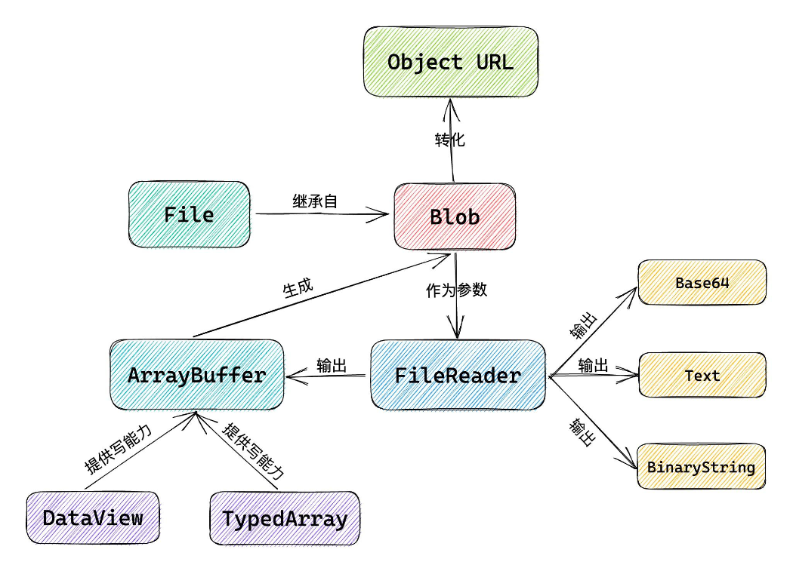
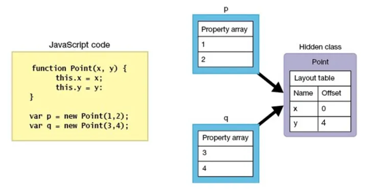
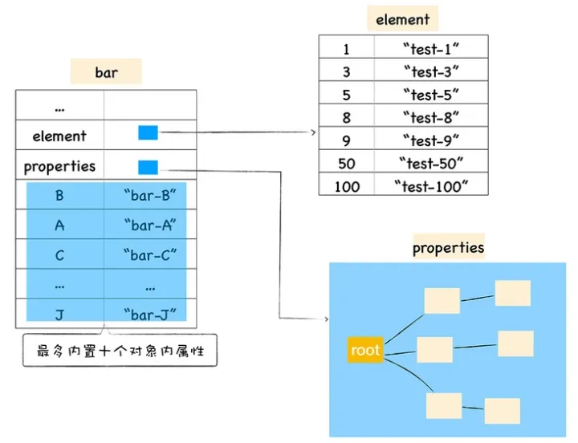
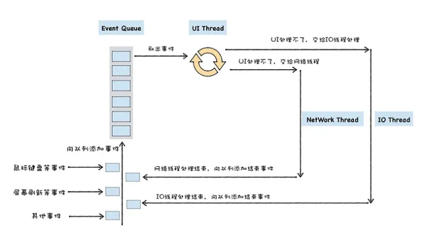
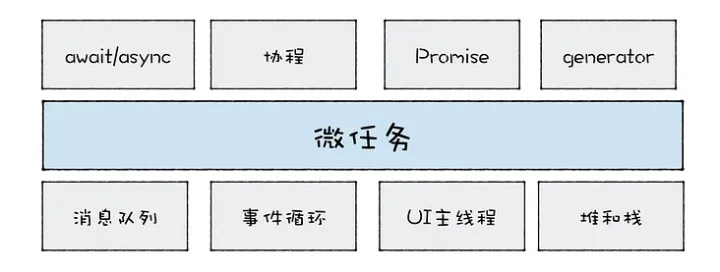
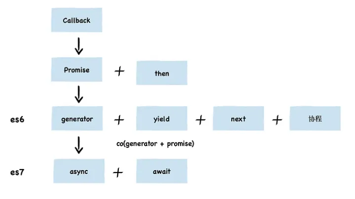
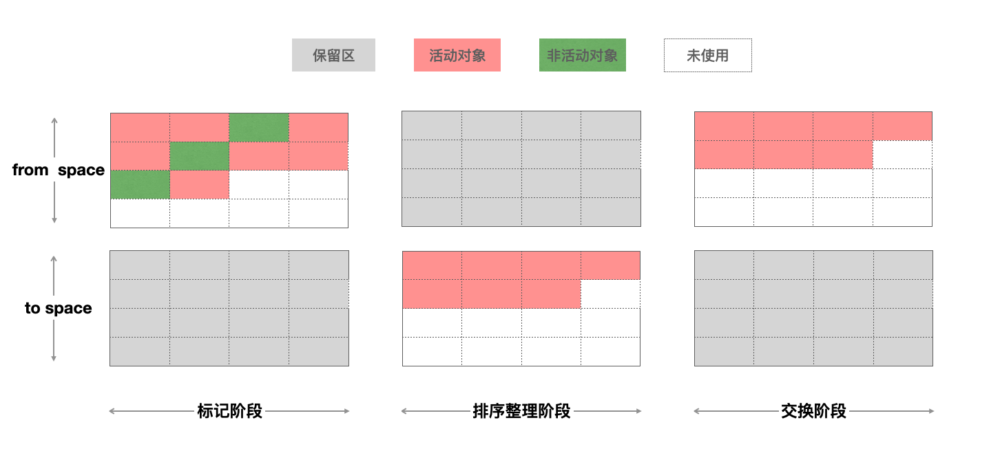
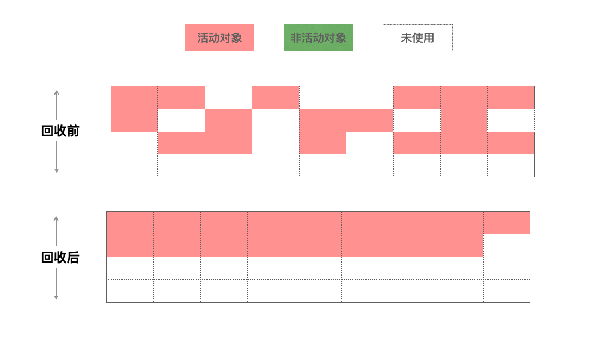

> [!note]
> 
> 如果我们相信程序是简单的、可解释的，无非是数据结构+算法。那么，所有编程范式，语言风格，最终都将落实到具体的数据结构和算法上。

## 基础


## 事件循环

事件循环（Event loop）是负责驱动 JavaScript 运行时的一种机制，事件循环负责收集事件（包括用户事件以及其他非用户事件等）、对任务进行排队以便在合适的时候执行回调。然后它执行所有处于等待中的 JavaScript 任务，然后是微任务，然后在开始下一次循环之前执行一些必要的渲染和绘制操作。

## JavaScript 运行时

在执行 JavaScript 代码的时候，JavaScript 运行时实际上维护了一组用于执行 JavaScript 代码的**代理**。每个代理由一组执行上下文的集合、执行上下文栈、主线程、一组可能创建用于执行 worker 的额外的线程集合、一个任务队列以及一个微任务队列构成。除了主线程（某些浏览器在多个代理之间共享的主线程）之外，其他组成部分对该代理都是唯一的。

## JavaScript 执行上下文

当一段 JavaScript 代码在运行的时候，它实际上是运行在**执行上下文**中。下面 3 种类型的代码会创建一个新的执行上下文：

- 全局上下文是为运行代码主体而创建的执行上下文，也就是说，它是为那些存在于 JavaScript 函数之外的任何代码而创建的。
- 每个函数会在执行的时候创建自己的执行上下文。这个上下文就是通常说的“本地上下文”。
- 使用 [``eval()``](https://developer.mozilla.org/zh-CN/docs/Web/JavaScript/Reference/Global_Objects/eval) 函数也会创建一个新的执行上下文。

### 执行上下文栈

当 JavaScript 引擎第一次遇到脚本时，它会创建一个全局的执行上下文并且压入当前执行栈。每当引擎遇到一个函数调用，它会为该函数创建一个新的执行上下文并压入栈的顶部。

引擎会执行那些执行上下文位于栈顶的函数。当该函数执行结束时，执行上下文从栈中弹出，控制流程到达当前栈中的下一个上下文。

### 创建阶段

#### this 绑定

- 在全局执行上下文中，this的值指向全局对象，**在浏览器表现为引用 Window 对象**。
- 在函数执行上下文中，this的值取决于该函数是如何被调用的。如果它被一个引用对象调用，那么this会被设置成那个对象，否则this的值被设置为全局对象或者**undefined（在严格模式下）**。

#### 创建词法环境

| 环境类型 | 环境组成             | 描述                                                         |
| -------- | -------------------- | ------------------------------------------------------------ |
| 全局环境 | **对象**环境记录器   | 用来定义出现在**全局上下文**中的变量和函数的关系。           |
|          | 外部环境的引用       | 它可以访问其父级词法环境**（作用域）**。                     |
| 函数环境 | **声明式**环境记录器 | 存储变量、函数和参数。<br/>函数环境下还包括一个传递给函数的**arguments**对象（此对象存储索引和参数的映射）和传递给函数的参数的**length**。 |
|          | 外部环境的引用       | 它可以访问其父级词法环境`（作用域）`。                       |

**词法环境**是一种规范类型，基于 ECMAScript 代码的词法嵌套结构来定义**标识符**和具体变量和函数的关联。一个词法环境由环境记录器和一个可能的引用**外部**词法环境的空值组成。

简单来说**词法环境**是一种持有**标识符—变量映射**的结构。（这里的**标识符**指的是变量/函数的名字，而**变量**是对实际对象[包含函数类型对象]或原始数据的引用）。

#### 创建变量环境

变量环境也是一个词法环境，所以它有着上面定义的词法环境的所有属性，其环境记录器持有**变量声明语句**在执行上下文中创建的绑定关系。

在 ES6 中，**词法环境**组件和**变量环境**的一个不同就是前者被用来存储函数声明和变量（`let`和`const`）绑定，而后者只用来存储`var`变量绑定。

#### 闭包

**闭包**（closure）是一个函数以及其捆绑的周边环境状态（**lexical environment**，**词法环境**）的引用的组合。

具体体现为函数作为 javascript 中的一等公民，可以作为函数的参数和返回值，且函数再执行时可以通过创建的函数上下文-词法环境-外部环境的引用访问其父级词法环境（作用域）中环境记录器的标识符（变量/函数）

如果不是某些特定任务需要使用闭包，在其他函数中创建函数是不明智的，因为闭包在处理速度和内存消耗方面对脚本性能具有负面影响。

#### 变量提升

是对创建上下文时环境记录器预先记录变量的行为的描述，其具体表现为使用 var 声明的变量在变量环境中默认会赋值 undefined，提前访问不会报错，而 let、const 声明的变量会赋值 uninitialized，提前访问会报语法错误。

### 执行阶段

执行代码，内存不可达时进行垃圾回收。

## 垃圾回收

## 原型/原型链

JS 原型是指为其它对象提供共享属性访问的对象。在创建对象时，每个对象都包含一个隐式引用指向它的原型对象或者 null。

原型也是对象，因此它也有自己的原型。这样构成一个原型链。

### 原型链的作用

在访问一个对象的属性时，实际上是在查询原型链。这个对象是原型链的第一个元素，先检查它是否包含属性名，如果包含则返回属性值，否则检查原型链上的第二个元素，以此类推。

### 原型继承

1. 通过 Object.create 或者 Object.setPrototypeOf 显式继承另一个对象，将它设置为原型。
2. 通过 constructor 构造函数，在使用 new 关键字实例化时，会自动继承 constructor 的 prototype 对象，作为实例的原型（隐式继承）。

在 ES2015 中提供了 class 的风格，工作原理与 constructor 工作方式一致，写起来更内聚一些。

### ConstructorB 如何继承 ConstructorA

JavaScript 里的继承，是对象跟对象之间的继承。constructor 的主要用途是初始化对象的属性 因此，两个 Constructor 之间的继承，需要分开两个步骤。

1. 编写新的 constructor，将两个 Constructor 通过 call/apply 的方式，合并它们的属性初始化。按照超类优先的顺序进行。
2. 取出超类和子类的原型对象，通过 Object.create/Object.setPrototypeOf 显式原型继承的方式，设置子类的原型为超类原型。

整个过程手动编写起来比较繁琐，因此建议通过 ES2015 提供的 class 和 extends 关键字去完成继承，它们内置了上述两个步骤。

## var、let、const 的区别

| 关键字 | 执行上下文环境 | {} 中作用域     | 重新赋值 |
| ------ | -------------- | --------------- | -------- |
| var    | 变量环境       | 全局/函数作用域 |          |
| let    | 词法环境       | 块级作用域      |          |
| const  | 词法环境       | 块级作用域      |          |

## 全局 var 与 window 属性的区别（TODO 从作用域观点解释）

在全局作用域中使用 var 声明的变量或不使用关键字直接书写的变量会作为 windows 的变量存在，其主要特点为

|        | configurabel（是否可删除） |      |
| ------ | -------------------------- | ---- |
| var    | true                       |      |
| window | false                      |      |
|        |                            |      |


1. 使用 `var` 声明的变量其xx符 configurabel 属性为 true，属性无法使用 delete 删除，而 `window` 为 false 可以删除。
2. var 声明的变量存在变量提升现象，提前访问为 undefined，而 window 对象属性提前访问直接抛出引用报错。

## 防抖、节流

## 数组应用

## 函数应用

### call，band

## 字符串应用

### 统计字符串字符数量

## 实现迭代器

```js
const obj = {}
obj[Symbol.iterator] = function* 	() {
  yield* obj.keys()
}
```

## ==Web API==

## 视口属性

### Window

| Width/height | 描述                                   | 只读     |
| :----------- | :------------------------------------- | -------- |
| inner        | 返回以像素为单位的窗口的内部宽度/高度  | &#x2705; |
| outer        | 返回整个浏览器窗口的宽度               | &#x2705; |
| **X/Y**      |                                        |          |
| scroll       | 返回文档/页面水平/垂直方向滚动的像素值 | &#x2705; |

### Element

| Width/Height | margin | border   | padding            | content  | scroll   | other（视口外） | 只读     |
| ------------ | ------ | -------- | ------------------ | -------- | -------- | --------------- | -------- |
| offset       |        | &#x2705; | :white_check_mark: | ✅        | &#x2705; | &#x2705;        | &#x2705; |
| client       |        |          | &#x2705;           | &#x2705; |          |                 | &#x2705; |
| scroll       |        |          | &#x2705;           | &#x2705; |          | &#x2705;        | &#x2705; |

| Top/Left | 描述                                                         | 只读     |
| -------- | :----------------------------------------------------------- | -------- |
| offset   | 返回当前元素相对于其`offsetParent`元素的内边距的距离<br />`HTMLElement.offsetParent`返回一个指向最近的（指包含层级上的最近）包含该元素的定位元素或者最近的`table`,`td`,`th`,`body`元素<br />当元素的`style.display`设置为 "none" 时，`offsetParent`返回`null` | &#x2705; |
| client   | 返回元素边框的宽度                                           | &#x2705; |
| scroll   | 获取或设置元素内容从其顶部/左部边缘滚动的像素数              |          |

| 获取元素宽高方案                | 描述                                    |
| ------------------------------- | :-------------------------------------- |
| offset \| clinet \| scroll 同上 |                                         |
| HTMLElement.style               | 元素的内联`style`属性中定义的属性分配值 |
| getComputedStyle()              | 返回计算后报告元素的所有 CSS 属性的值   |
| getBoundingClientRect()         | 提供元素的大小及其相对于视口的位置      |


## 文件 API



## 惰性解析

> **惰性解析**是指解析器在解析的过程中，如果遇到函数声明，那么会跳过函数内部的代码，并不会为其生成 AST 和字节码，而仅仅生成顶层代码的 AST 和字节码。

在编译 JavaScript 代码的过程中，V8 并不会一次性将所有的 JavaScript 解析为中间代码，这主要是基于以下两点：

1. 首先，**如果一次解析和编译所有的 JavaScript 代码**，过多的代码会增加编译时间，这会严重影响到首次执行 JavaScript 代码的速度，让用户感觉到**卡顿**。因为有时候一个页面的 JavaScript 代码很大，如果要将所有的代码一次性解析编译完成，那么会大大增加用户的等待时间。
2. 其次，解析完成的字节码和编译之后的机器代码都会存放在内存中，如果一次性解析和编译所有 JavaScript 代码，那么这些中间代码和机器代码将会一直**占用内存**。

基于以上的原因，所有主流的 JavaScript 虚拟机都实现了惰性解析。

**闭包给惰性解析带来的问题**：外部变量引用不能随着函数的执行上下文销毁而被销毁掉。

## 预解析器

> V8 引入**预解析器**，比如当解析顶层代码的时候，遇到了一个函数，那么预解析器并不会直接跳过该函数，而是对该函数做一次快速的预解析。

1. 判断当前函数是不是存在一些语法上的错误，发现了语法错误，那么就会向 V8 抛出语法错误。
2. 检查函数内部是否引用了外部变量，如果引用了外部的变量，预解析器会将栈中的变量复制到堆中，在下次执行到该函数的时候，直接使用堆中的引用，这样就解决了闭包所带来的问题。

## 隐藏类

> 在 V8 中，**每个对象都有一个 map 属性**，该属性值指向该对象的隐藏类。不过**如果两个对象的形状是相同的，V8 就会为其复用同一个隐藏类**。

这样有两个好处：

- 减少隐藏类的创建次数，也间接加速了代码的执行速度。
- 减少了隐藏类的存储空间。

那么，什么情况下两个对象的形状是相同的，要满足以下两点：

- 相同的属性名称。
- 相等的属性个数。

隐藏类将对象划分成不同的组，对于组内对象拥有相同的属性名和属性值的情况，将这些组的属性名和对应的偏移位置保存在一个隐藏类中，组内所有对象共享该信息。同时，也可以识别属性不同的对象。示例如下：



给一个对象添加新的属性，删除新的属性，或者改变某个属性的数据类型都会改变这个对象的形状，那么势必也就会触发 V8 为改变形状后的对象重建新的隐藏类。

### 内联缓存

> 正常访问对象属性的过程是：首先获取隐藏类的地址，然后根据属性名查找偏移值，然后计算该属性的地址。虽然相比以往在整个执行环境中查找减小了很大的工作量，但依然比较耗时。能不能将之前查询的结果缓存起来，供再次访问呢？当然是可行的，这就是内嵌缓存 **(Inline Cache)**，简称为 IC。

- 在 V8 执行函数的过程中，会观察函数中一些**调用点 (CallSite)** 上的关键中间数据，然后将这些数据缓存起来，当下次再次执行该函数的时候，V8 就可以直接利用这些中间数据，节省了再次获取这些数据的过程，因此 V8 利用 IC，可以有效提升一些重复代码的执行效率。
- IC 会为每个函数维护一个**反馈向量 (FeedBack Vector)**，反馈向量记录了函数在执行过程中的一些关键的中间数据。
- 反馈向量其实就是一个表结构，它由很多项组成的，每一项称为一个插槽 (Slot)，V8 会依次将执行 loadX 函数的中间数据写入到反馈向量的插槽中。
- 当 V8 再次调用 loadX 函数时，比如执行到 loadX 函数中的 return obj.x 语句时，它就会在对应的插槽中查找 x 属性的偏移量，之后 V8 就能直接去内存中获取 obj.x 的属性值了。这样就大大提升了 V8 的执行效率。

### 单态、多态和超态

- 如果一个插槽中只包含 1 个隐藏类，那么我们称这种状态为单态 (monomorphic)；
- 如果一个插槽中包含了 2 ～ 4 个隐藏类，那我们称这种状态为多态 (polymorphic)；
- 如果一个插槽中超过 4 个隐藏类，那我们称这种状态为超态 (magamorphic)。
- 单态的性能优于多态和超态，所以我们需要稍微避免多态和超态的情况。要避免多态和超态，那么就尽量默认所有的对象属性是不变的，比如你写了一个 loadX(obj) 的函数，那么当传递参数时，尽量不要使用多个不同形状的 obj 对象。

## 优化回滚

> 因为 V8 是基于 AST 直接生成本地代码，没有经过中间表示层的优化，所以本地代码尚未经过很好的优化。于是，在 2010 年，V8 引入了新的编译器-Crankshaft，它主要针对热点函数进行优化，基于 JavaScript 源代码开始分析而非本地代码，同时构建 Hydroger 图并基于此来进行优化分析。

Crankshaft 编译器为了性能考虑，通常会做出比较乐观和大胆的预测—代码稳定且变量类型不变，所以可以生成高效的本地代码。但是，鉴于 JavaScript 的一个弱类型的语言，变量类型也可能在执行的过程中进行改变，鉴于这种情况，V8 会将该编译器做的想当然的优化进行回滚，称为优化回滚。

该函数被调用多次之后，V8 引擎可能会触发 Crankshaft 编译器对其进行优化，而优化代码认为示例代码的类型信息都已经被确定。但，由于尚未真正执行到 new Date()这个地方，并未获取 unknown 这个变量的类型，V8 只得将该部分代码进行回滚。优化回滚是一个很耗时的操作，在写代码过程中，尽量不要触发优化该操作。

在最近发布的 V8 5.9 版本中，新增了一个 Ignition 字节码解释器，TurboFan 和 Ignition 结合起来共同完成 JavaScript 的编译。这个版本中消除 Cranshaft 这个旧的编译器，并让新的 Turbofan 直接从字节码来优化代码，并当需要进行反优化的时候直接反优化到字节码，而不需要再考虑 JS 源代码。

## 内部存储对象形式

> 在[ECMAScript 规范](https://link.zhihu.com/?target=https%3A//link.segmentfault.com/%3Fenc%3D3ZZ0dumlISZGkYNJUNpHAA%3D%3D.Z9kiu6V9GNFz3bo8rtc0hyws7wC%2FnbwqyM6tWWK27tc6nAVdEif4oXPoeZaxiYvMjj9ZDVIFfwG%2BSl%2F5jHyCtg%3D%3D)中定义了**数字属性应该按照索引值大小升序排列，字符串属性根据创建时的顺序升序排列**。在这里我们把对象中的数字属性称为**排序属性**，在 V8 中被称为 elements，字符串属性就被称为**常规属性**，在 V8 中被称为 properties。在 V8 内部，为了有效地提升存储和访问这两种属性的性能，分别使用了两个线性数据结构来分别保存排序属性和常规属性。同时 v8 将部分常规属性直接存储到对象本身，我们把这称为**对象内属性 (in-object properties)**，不过对象内属性的数量是固定的，默认是 10 个。

JavaScript 中的对象是由一组组属性和值组成的，所以最简单的方式是使用一个字典来保存属性和值，但是由于字典是非线性结构，所以如果使用字典，读取效率会大大降低。为了提升查找效率，**V8 在对象中添加了两个隐藏属性，排序属性和常规属性**，element 属性指向了 elements 对象，在 elements 对象中，会按照顺序存放排序属性。properties 属性则指向了 properties 对象，在 properties 对象中，会按照创建时的顺序保存常规属性。

保存在线性数据结构中的属性称之为“**快属性**”，因为线性数据结构中只需要通过索引即可以访问到属性，虽然访问线性结构的速度快，但是**如果从线性结构中添加或者删除大量的属性时，则执行效率会非常低，这主要因为会产生大量时间和内存开销**。

因此，如果一个对象的属性过多时，V8 就会采取另外一种存储策略，那就是“**慢属性**”策略，但慢属性的对象内部会有独立的非线性数据结构 (字典) 作为属性存储容器。所有的属性元信息不再是线性存储的，而是直接保存在属性字典中。

通过引入这两个属性，加速了 V8 查找属性的速度，为了更加进一步提升查找效率，V8 还实现了内置内属性的策略，当常规属性少于一定数量时，V8 就会将这些常规属性直接写进对象中，这样又节省了一个中间步骤。

**如果对象中的属性过多时，或者存在反复添加或者删除属性的操作，那么 V8 就会将线性的存储模式降级为非线性的字典存储模式，这样虽然降低了查找速度，但是却提升了修改对象的属性的速度**。



## 堆和栈空间

### 栈空间

> 现代语言都是基于函数的，每个函数在执行过程中，都有自己的生命周期和作用域，当函数执行结束时，其作用域也会被销毁，因此，我们会使用栈这种数据结构来管理函数的调用过程，我们也把管理函数调用过程的栈结构称之为**调用栈**。
>
> **栈空间**主要是用来管理 JavaScript 函数调用的，栈是内存中连续的一块空间，同时栈结构是“先进后出”的策略。在函数调用过程中，涉及到上下文相关的内容都会存放在栈上，比如原生类型、引用到的对象的地址、函数的执行状态、this 值等都会存在在栈上。当一个函数执行结束，那么该函数的执行上下文便会被销毁掉。
>
> **栈空间的最大的特点是空间连续**，所以在栈中每个元素的地址都是固定的，因此栈空间的查找效率非常高，但是通常在内存中，很难分配到一块很大的连续空间，因此，V8 对栈空间的大小做了限制，如果函数调用层过深，那么 V8 就有可能抛出栈溢出的错误。

### 堆空间

> **堆空间**是一种**树**形的存储结构，**用来存储对象类型的离散的数据**，JavaScript 中除了原生类型的数据，其他的都是对象类型，诸如函数、数组，在浏览器中还有 window 对象、document 对象等，这些都是存在堆空间的。

### 闭包

> 在内部函数中访问父函数中定义的变量的现象称为闭包。
>
> 因为 JavaScript 中的函数是一等公民，所以允许在函数内部定义新的函数并作为另外一个函数的返回值。而通过在堆内存中创建闭包所引用值的引用对象，使得后续执行上下文可以访问到闭包的值。

## 静态作用域与动态作用域

### 静态作用域

> 如果一门语言的作用域是**静态作用域**，那么**符号之间的引用关系能够根据程序代码在编译时就确定清楚，在运行时不会变**。某个函数是在哪声明的，就具有它所在位置的作用域。它能够访问哪些变量，那么就跟这些变量绑定了，在运行时就一直能访问这些变量。即静态作用域可以由程序代码决定，在编译时就能完全确定。大多数语言都是静态作用域的。

### 动态作用域

> **动态作用域（Dynamic Scope）**。也就是说，变量引用跟变量声明不是在编译时就绑定死了的。在运行时，它是在运行环境中动态地找一个相同名称的变量。在 macOS 或 Linux 中用的 bash 脚本语言，就是动态作用域的。

## 执行上下文

> 执行上下文是评估和执行 JavaScript 代码的环境的抽象概念。每当 Javascript 代码在运行的时候，它都是在执行上下文中运行。

|                  Classify | Discription                                            |
| ------------------------: | ------------------------------------------------------ |
|                `ES3 组成` |                                                        |
|                 **scope** | 作用域，也常常被叫做作用域链。                         |
|       **variable object** | 变量对象，用于存储变量的对象。                         |
|            **this value** | this 值。                                              |
|                `ES5 组成` |                                                        |
|   **lexical environment** | 词法环境，当获取变量时使用。                           |
|  **variable environment** | 变量环境，当声明变量时使用。                           |
|            **this value** | this 值。                                              |
|             `ES2018 组成` |                                                        |
|   **lexical environment** | 词法环境，当获取变量或者 this 值时使用。               |
|  **variable environment** | 变量环境，当声明变量时使用                             |
| **code evaluation state** | 用于恢复代码执行位置。                                 |
|              **Function** | 执行的任务是函数时使用，表示正在被执行的函数。         |
|        **ScriptOrModule** | 执行的任务是脚本或者模块时使用，表示正在被执行的代码。 |
|                 **Realm** | 使用的基础库和内置对象实例。                           |
|             **Generator** | 仅生成器上下文有这个属性，表示当前生成器。             |

### 执行上下文类型

- **全局执行上下文**：这是默认或者说基础的上下文，任何不在函数内部的代码都在全局上下文中。它会执行两件事：创建一个全局的 window 对象（浏览器的情况下），并且设置 `this` 的值等于这个全局对象。一个程序中只会有一个全局执行上下文。

- **函数执行上下文**：每当一个函数被调用时, 都会为该函数创建一个新的上下文。每个函数都有它自己的执行上下文，不过是在函数被调用时创建的。函数上下文可以有任意多个。每当一个新的执行上下文被创建，它会按定义的顺序（将在后文讨论）执行一系列步骤。

- **Eval 函数执行上下文**：执行在 `eval` 函数内部的代码也会有它属于自己的执行上下文，但由于 JavaScript 开发者并不经常使用 `eval`，所以在这里我不会讨论它。

### 执行栈

执行栈，也就是在其它编程语言中所说的“调用栈”，是一种拥有 LIFO（后进先出）数据结构的栈，被用来存储代码运行时创建的所有执行上下文。

当 JavaScript 引擎第一次遇到你的脚本时，它会创建一个全局的执行上下文并且压入当前执行栈。每当引擎遇到一个函数调用，它会为该函数创建一个新的执行上下文并压入栈的顶部。

引擎会执行那些执行上下文位于栈顶的函数。当该函数执行结束时，执行上下文从栈中弹出，控制流程到达当前栈中的下一个上下文。

### 创建阶段

1. **this** 值的决定，即 **This 绑定**。
2. 创建**词法环境**组件。
3. 创建**变量环境**组件。

#### This 绑定

在全局执行上下文中，`this` 的值指向全局对象。(在浏览器中，`this`引用 Window 对象)。

在函数执行上下文中，`this` 的值取决于该函数是如何被调用的。如果它被一个引用对象调用，那么 `this` 会被设置成那个对象，否则 `this` 的值被设置为全局对象或者 `undefined`（在严格模式下）。

#### 词法环境

**词法环境**是一种规范类型，基于 ECMAScript 代码的词法嵌套结构来定义**标识符**和具体变量和函数的关联。一个词法环境由环境记录器和一个可能的引用**外部**词法环境的空值组成。

简单来说**词法环境**是一种持有**标识符—变量映射**的结构。（这里的**标识符**指的是变量/函数的名字，而**变量**是对实际对象[包含函数类型对象]或原始数据的引用）。

| 词法环境类型 | 描述                                                         |
| -----------: | ------------------------------------------------------------ |
| **全局环境** | （在全局执行上下文中）是没有外部环境引用的词法环境。全局环境的外部环境引用是 **null**。<br />它拥有内建的 Object/Array/等、在环境记录器内的原型函数（关联全局对象，比如 window 对象）还有任何用户定义的全局变量<br />并且 `this`的值指向全局对象。 |
| **函数环境** | 函数内部用户定义的变量存储在**环境记录器**中。并且引用的外部环境可能是全局环境，或者任何包含此内部函数的外部函数。 |

|       词法环境组成 | 描述                                   |
| -----------------: | -------------------------------------- |
|     **环境记录器** | 存储变量和函数声明的实际位置。         |
| **外部环境的引用** | 它可以访问其父级词法环境`（作用域）`。 |

|         词法环境类型 | 描述                                                         |
| -------------------: | ------------------------------------------------------------ |
|   **对象环境记录器** | 用来定义出现在**全局上下文**中的变量和函数的关系。           |
| **声明式环境记录器** | 存储变量、函数和参数。<br />函数环境下还包括一个传递给函数的 `arguments` 对象（此对象存储索引和参数的映射）和传递给函数的参数的 **length**。 |

`总结：`

- 在**全局环境**中，环境记录器是对象环境记录器。
- 在**函数环境**中，环境记录器是声明式环境记录器。

```js
// 词法环境伪代码
GlobalExectionContext = {
  LexicalEnvironment: {
    EnvironmentRecord: {
      Type: "Object",
      // 在这里绑定标识符
    }
    outer: <null>
  }
}

FunctionExectionContext = {
  LexicalEnvironment: {
    EnvironmentRecord: {
      Type: "Declarative",
      // 在这里绑定标识符
    }
    outer: <Global or outer function environment reference>
  }
}
```

#### 变量环境

它同样是一个词法环境，其环境记录器持有**变量声明语句**在执行上下文中创建的绑定关系。

如上所述，变量环境也是一个词法环境，所以它有着上面定义的词法环境的所有属性。

在 ES6 中，**词法环境**组件和**变量环境**的一个不同就是前者被用来存储函数声明和变量（`let` 和 `const`）绑定，而后者只用来存储 `var` 变量绑定。

```js
// 执行上下文伪代码
GlobalExectionContext = {

  ThisBinding: <Global Object>,

  LexicalEnvironment: {
    EnvironmentRecord: {
      Type: "Object",
      // 在这里绑定标识符
      a: < uninitialized >,
      b: < uninitialized >,
      multiply: < func >
    }
    outer: <null>
  },

  VariableEnvironment: {
    EnvironmentRecord: {
      Type: "Object",
      // 在这里绑定标识符
      c: undefined,
    }
    outer: <null>
  }
}

FunctionExectionContext = {
  ThisBinding: <Global Object>,

  LexicalEnvironment: {
    EnvironmentRecord: {
      Type: "Declarative",
      // 在这里绑定标识符
      Arguments: {0: 20, 1: 30, length: 2},
    },
    outer: <GlobalLexicalEnvironment>
  },

VariableEnvironment: {
    EnvironmentRecord: {
      Type: "Declarative",
      // 在这里绑定标识符
      g: undefined
    },
    outer: <GlobalLexicalEnvironment>
  }
}
```

`TIP`

- 只有遇到调用函数时，函数执行上下文才会被创建。
- 在创建阶段时，引擎检查代码找出变量和函数声明，虽然函数声明完全存储在环境中，但是变量最初设置为 `undefined`（`var` 情况下），或者未初始化（`let` 和 `const` 情况下）。
- 这就是为什么你可以在声明之前访问 `var` 定义的变量（虽然是 `undefined`），但是在声明之前访问 `let` 和 `const` 的变量会得到一个引用错误。也被称为变量提升。

### 执行阶段

在此阶段，完成对所有这些变量的分配，最后执行代码。

## 事件循环系统

### V8 是如何执行回调函数

回调函数有两种类型：同步回调和异步回调，同步回调函数是在执行函数内部被执行的，而异步回调函数是在执行函数外部被执行的。

UI 线程提供一个**消息队列**，并将待执行的事件添加到消息队列中，然后 UI 线程会不断循环地从消息队列中取出事件、执行事件。

通用 UI 线程宏观架构：



### 事件循环系统构成

- **主线程**：UI 线程。
- **调用栈**：一种数据结构、用来管理在主线程上执行的函数的调用关系。主线程在执行任务的过程中，如果函数的调用层次过深，可能造成栈溢出的错误，
- **消息队列**：用于存放等待主线程执行的宏任务 ‘事件’列表。
- **任务**：UI 线程每次从消息队列中取出事件、执行事件的过程称为一次任务。
- **宏任务**：指消息队列中的等待被主线程执行的事件。每个宏任务在执行时，V8 都会重新创建栈，然后随着宏任务中函数调用，栈也随之变化，最终，当该宏任务执行结束时，整个栈又会被清空，接着主线程继续执行下一个宏任务。
- **微任务**：一个需要异步执行的函数、执行的时机在主线程执行结束之后、当前宏任务结束之前。



常见宏任务有：**主 js、UI 渲染**、setTimeout、setInterval、setImmediately、requestAnimationFrame、I/O 等

常见微任务有：process.nextTick()、promise.then()、Object.observe()等

**JavaScript 中之所以要引入微任务，主要是由于主线程执行消息队列中宏任务的时间颗粒度太粗了，无法胜任一些对精度和实时性要求较高的场景，微任务可以在实时性和效率之间做一个有效的权衡**。另外使用微任务，可以改变我们现在的异步编程模型，使得我们可以使用同步形式的代码来编写异步调用。

微任务是基于消息队列、事件循环、UI 主线程还有堆栈而来的，然后基于微任务，又可以延伸出协程、Promise、Generator、await/async 等现代前端经常使用的一些技术。


如果当前的任务中产生了一个微任务，通过 Promise.resolve() 或者 Promise.reject() 都会触发微任务，触发的微任务不会在当前的函数中被执行，所以**执行微任务时，不会导致栈的无限扩张**

和异步调用不同，微任务依然会在当前任务执行结束之前被执行，这也就意味着**在当前微任务执行结束之前，消息队列中的其他任务是不可能被执行的**。因此在函数内部触发的微任务，一定比在函数内部触发的宏任务要优先执行。

微任务依然是在当前的任务中执行的，所以如果在微任务中循环触发新的微任务，那么将导致消息队列中的其他任务没有机会被执行。

### 前端异步编程方案史



**Callback 模式的异步编程模型**需要实现大量的回调函数，大量的回调函数会打乱代码的正常逻辑，使得代码变得不线性、不易阅读，这就是我们所说的**回调地狱问题**。

**Promise** 能很好地解决回调地狱的问题，我们可以按照线性的思路来编写代码，这个过程是线性的，非常符合人的直觉。

但是这种方式**充满了 Promise 的 then() 方法**，如果处理流程比较复杂的话，那么整段代码将**充斥着大量的 then，语义化不明显，代码不能很好地表示执行流程**。我们想要通过**线性的方式**来编写异步代码，要实现这个理想，**最关键的是要能实现函数暂停和恢复执行的功能**。而**生成器**就可以实现函数暂停和恢复，我们可以在生成器中使用同步代码的逻辑来异步代码 (实现该逻辑的核心是协程)。

但是在生成器之外，我们还需要一个**触发器**来驱动生成器的执行。前端的最终方案就是 async/await，async 是一个可以暂停和恢复执行的函数，在 async 函数内部使用 await 来暂停 async 函数的执行，await 等待的是一个 Promise 对象，如果 Promise 的状态变成 resolve 或者 reject，那么 async 函数会恢复执行。因此，使用 async/await 可以实现以同步的方式编写异步代码这一目标。和生成器函数一样，使用了 async 声明的函数在执行时，也是一个单独的协程，我们可以使用 await 来暂停该协程，由于 await 等待的是一个 Promise 对象，我们可以 resolve 来恢复该协程。

## 垃圾回收

### 代际假说

在垃圾回收中有一个重要的术语：“代际假说”；代际假说表明很多对象在内存中存在的时间很短。换句话说，从垃圾回收的角度来看，很多对象一经分配内存空间随即就变成了不可访问的。这个假说不仅仅适用于 V8 和 JavaScript。

 代际假说有以下两个特点： 

1. 大部分对象在内存中存在的时间很短，简单来说，就是很多对象一经分配内存，很快就变得不可访问。
2. 不死的对象，会活得更久。

### 分代堆布局

堆在 V8 中会分为两块不同的区域，这两块区域分别称之为老生代和新生代，新生代又进一步分为 ‘nursery’（from-space） 子代和 ‘intermediate’ (to-space)子代两块区域。 

一个对象第一次分配内存时会被分配到新生代中的‘from-space’ 子代；如果进过下一次垃圾回收这个对象还存在新生代中，这时候我们移动到 ‘to-space’ 子代，再经过下一次垃圾回收这个对象还在新生代，这时候我们就会把这个对象移动到老生代。

### JavaScript 的内存管理

不管什么程序语言，内存生命周期基本是一致的：

1. 分配你所需要的内存
2. 使用分配到的内存（读、写）
3. 不需要时将其释放|归还

与其他需要手动管理内存的语言不通，在 JavaScript 中，当我们创建变量（对象，字符串等）的时候，系统会自动给对象分配对应的内存。

```js
var n = 123 // 给数值变量分配内存
var s = 'azerty' // 给字符串分配内存

var o = {
  a: 1,
  b: null
} // 给对象及其包含的值分配内存

// 给数组及其包含的值分配内存（就像对象一样）
var a = [1, null, 'abra']

function f(a) {
  return a + 2
} // 给函数（可调用的对象）分配内存

// 函数表达式也能分配一个对象
someElement.addEventListener(
  'click',
  function () {
    someElement.style.backgroundColor = 'blue'
  },
  false
)
```

当系统发现这些变量不再被使用的时候，会自动释放（垃圾回收）这些变量的内存，开发者不用过多的关心内存问题。

虽然这样，我们开发过程中也需要了解 JavaScript 的内存管理机制，这样才能避免一些不必要的问题，比如下面代码：

```js
{}=={} // false
[]==[] // false
''=='' // true
```

在 JavaScript 中，数据类型分为两类，简单类型和引用类型，对于简单类型，内存是保存在栈（stack）空间中，复杂数据类型，内存是保存在堆（heap）空间中。

- 基本类型：这些类型在内存中分别占有固定大小的空间，他们的值保存在栈空间，我们通过按值来访问的
- 引用类型：引用类型，值大小不固定，栈内存中存放地址指向堆内存中的对象。是按引用访问的。

而对于栈的内存空间，只保存简单数据类型的内存，由操作系统自动分配和自动释放。而堆空间中的内存，由于大小不固定，系统无法无法进行自动释放，这个时候就需要 JS 引擎来手动的释放这些内存。

### 为什么需要垃圾回收

在 Chrome 中，v8 被限制了内存的使用（64 位约 1.4G/1464MB ， 32 位约 0.7G/732MB），为什么要限制呢？

1. 表层原因是，V8 最初为浏览器而设计，不太可能遇到用大量内存的场景
2. 深层原因是，V8 的垃圾回收机制的限制（如果清理大量的内存垃圾是很耗时间，这样会引起 JavaScript 线程暂停执行的时间，那么性能和应用直线下降）

前面说到栈内的内存，操作系统会自动进行内存分配和内存释放，而堆中的内存，由 JS 引擎（如 Chrome 的 V8）手动进行释放，当我们的代码没有按照正确的写法时，会使得 JS 引擎的垃圾回收机制无法正确的对内存进行释放（内存泄露），从而使得浏览器占用的内存不断增加，进而导致 JavaScript 和应用、操作系统性能下降。

### Chrome 垃圾回收算法

在 JavaScript 中，其实绝大多数的对象存活周期都很短，大部分在经过一次的垃圾回收之后，内存就会被释放掉，而少部分的对象存活周期将会很长，一直是活跃的对象，不需要被回收。为了提高回收效率，V8 将堆分为两类`新生代`和`老生代`，新生代中存放的是生存时间短的对象，老生代中存放的生存时间久的对象。

新生区通常只支持 1 ～ 8M 的容量，而老生区支持的容量就大很多了。对于这两块区域，V8 分别使用两个不同的垃圾回收器，以便更高效地实施垃圾回收。

- 副垃圾回收器 - Scavenge：主要负责新生代的垃圾回收。
- 主垃圾回收器 - Mark-Sweep & Mark-Compact：主要负责老生代的垃圾回收。

#### 新生代垃圾回收器 - Scavenge

在 JavaScript 中，任何对象的声明分配到的内存，将会先被放置在新生代中，而因为大部分对象在内存中存活的周期很短，所以需要一个效率非常高的算法。在新生代中，主要使用`Scavenge`算法进行垃圾回收，`Scavenge`算法是一个典型的牺牲空间换取时间的复制算法，在占用空间不大的场景上非常适用。

Scavange 算法将新生代堆分为两部分，分别叫`from-space`和`to-space`，工作方式也很简单，就是将`from-space`中存活的活动对象复制到`to-space`中，并将这些对象的内存有序的排列起来，然后将`from-space`中的非活动对象的内存进行释放，完成之后，将`from space` 和`to space`进行互换，这样可以使得新生代中的这两块区域可以重复利用。



简单的描述就是：

- 标记活动对象和非活动对象
- 复制 from space 的活动对象到 to space 并对其进行排序
- 释放 from space 中的非活动对象的内存
- 将 from space 和 to space 角色互换

那么，垃圾回收器是怎么知道哪些对象是活动对象和非活动对象的呢？

有一个概念叫对象的可达性，表示从初始的根对象（window，global）的指针开始，这个根指针对象被称为根集（root set），从这个根集向下搜索其子节点，被搜索到的子节点说明该节点的引用对象可达，并为其留下标记，然后递归这个搜索的过程，直到所有子节点都被遍历结束，那么没有被标记的对象节点，说明该对象没有被任何地方引用，可以证明这是一个需要被释放内存的对象，可以被垃圾回收器回收。

新生代中的对象什么时候变成老生代的对象呢？

在新生代中，还进一步进行了细分，分为`nursery`子代和`intermediate`子代两个区域，一个对象第一次分配内存时会被分配到新生代中的`nursery`子代，如果进过下一次垃圾回收这个对象还存在新生代中，这时候我们移动到 `intermediate` 子代，再经过下一次垃圾回收，如果这个对象还在新生代中，副垃圾回收器会将该对象移动到老生代中，这个移动的过程被称为晋升。

#### 老生代垃圾回收 - Mark-Sweep & Mark-Compact

新生代空间中的对象满足一定条件后，晋升到老生代空间中，在老生代空间中的对象都已经至少经历过一次或者多次的回收所以它们的存活概率会更大，如果这个时候再使用`scavenge`算法的话，会出现两个问题：

- scavenge 为复制算法，重复复制活动对象会使得效率低下
- scavenge 是牺牲空间来换取时间效率的算法，而老生代支持的容量较大，会出现空间资源浪费问题

所以在老生代空间中采用了 Mark-Sweep（标记清除） 和 Mark-Compact（标记整理） 算法。

##### Mark-Sweep

Mark-Sweep 处理时分为两阶段，标记阶段和清理阶段，看起来与 Scavenge 类似，不同的是，Scavenge 算法是复制活动对象，而由于在老生代中活动对象占大多数，所以 Mark-Sweep 在标记了活动对象和非活动对象之后，直接把非活动对象清除。

- 标记阶段：对老生代进行第一次扫描，标记活动对象
- 清理阶段：对老生代进行第二次扫描，清除未被标记的对象，即清理非活动对象


看似一切 perfect，但是还遗留一个问题，被清除的对象遍布于各内存地址，产生很多内存碎片。

##### Mark-Compact

由于 Mark-Sweep 完成之后，老生代的内存中产生了很多内存碎片，若不清理这些内存碎片，如果出现需要分配一个大对象的时候，这时所有的碎片空间都完全无法完成分配，就会提前触发垃圾回收，而这次回收其实不是必要的。

为了解决内存碎片问题，Mark-Compact 被提出，它是在 Mark-Sweep 的基础上演进而来的，相比 Mark-Sweep，Mark-Compact 添加了活动对象整理阶段，将所有的活动对象往一端移动，移动完成后，直接清理掉边界外的内存。



#### 全停顿 - Stop-The-World

由于垃圾回收是在 JS 引擎中进行的，而 Mark-Compact 算法在执行过程中需要移动对象，而当活动对象较多的时候，它的执行速度不可能很快，为了避免 JavaScript 应用逻辑和垃圾回收器的内存资源竞争导致的不一致性问题，垃圾回收器会将 JavaScript 应用暂停，这个过程，被称为`全停顿`（stop-the-world）。

在新生代中，由于空间小、存活对象较少、Scavenge 算法执行效率较快，所以全停顿的影响并不大。而老生代中就不一样，如果老生代中的活动对象较多，垃圾回收器就会暂停主线程较长的时间，使得页面变得卡顿。

### 优化 - Orinoco

orinoco 为 V8 的垃圾回收器的项目代号，为了提升用户体验，解决全停顿问题，它利用了增量标记、懒性清理、并发、并行来降低主线程挂起的时间。

#### 增量标记 - Incremental-marking

为了降低全堆垃圾回收的停顿时间，增量标记将原本的标记全堆对象拆分为一个一个任务，让其穿插在 JavaScript 应用逻辑之间执行，它允许堆的标记时的 5~10ms 的停顿。增量标记在堆的大小达到一定的阈值时启用，启用之后每当一定量的内存分配后，脚本的执行就会停顿并进行一次增量标记。


#### 懒性清理 - Lazy sweeping

增量标记只是对活动对象和非活动对象进行标记，惰性清理用来真正的清理释放内存。当增量标记完成后，假如当前的可用内存足以让我们快速的执行代码，其实我们是没必要立即清理内存的，可以将清理的过程延迟一下，让 JavaScript 逻辑代码先执行，也无需一次性清理完所有非活动对象内存，垃圾回收器会按需逐一进行清理，直到所有的页都清理完毕。

增量标记与惰性清理的出现，使得主线程的最大停顿时间减少了 80%，让用户与浏览器交互过程变得流畅了许多，从实现机制上，由于每个小的增量标价之间执行了 JavaScript 代码，堆中的对象指针可能发生了变化，需要使用`写屏障`技术来记录这些引用关系的变化，所以也暴露出来增量标记的缺点：

- 并没有减少主线程的总暂停的时间，甚至会略微增加
- 由于写屏障（Write-barrier）机制的成本，增量标记可能会降低应用程序的吞吐量

#### 并发 - Concurrent

并发式 GC 允许在在垃圾回收的同时不需要将主线程挂起，两者可以同时进行，只有在个别时候需要短暂停下来让垃圾回收器做一些特殊的操作。但是这种方式也要面对增量回收的问题，就是在垃圾回收过程中，由于 JavaScript 代码在执行，堆中的对象的引用关系随时可能会变化，所以也要进行`写屏障`操作。


#### 并行 - Parallel

并行式 GC 允许主线程和辅助线程同时执行同样的 GC 工作，这样可以让辅助线程来分担主线程的 GC 工作，使得垃圾回收所耗费的时间等于总时间除以参与的线程数量（加上一些同步开销）。


### V8 当前垃圾回收机制

2011 年，V8 应用了增量标记机制。直至 2018 年，Chrome64 和 Node.js V10 启动并发标记（Concurrent），同时在并发的基础上添加并行（Parallel）技术，使得垃圾回收时间大幅度缩短。

#### 副垃圾回收器	

V8 在新生代垃圾回收中，使用并行（parallel）机制，在整理排序阶段，也就是将活动对象从`from-to`复制到`space-to`的时候，启用多个辅助线程，并行的进行整理。由于多个线程竞争一个新生代的堆的内存资源，可能出现有某个活动对象被多个线程进行复制操作的问题，为了解决这个问题，V8 在第一个线程对活动对象进行复制并且复制完成后，都必须去维护复制这个活动对象后的指针转发地址，以便于其他协助线程可以找到该活动对象后可以判断该活动对象是否已被复制。


#### 主垃圾回收器

V8 在老生代垃圾回收中，如果堆中的内存大小超过某个阈值之后，会启用并发（Concurrent）标记任务。每个辅助线程都会去追踪每个标记到的对象的指针以及对这个对象的引用，而在 JavaScript 代码执行时候，并发标记也在后台的辅助进程中进行，当堆中的某个对象指针被 JavaScript 代码修改的时候，写入屏障（[write barriers](https://link.zhihu.com/?target=https%3A//dl.acm.org/citation.cfm%3Fid%3D2025255)）技术会在辅助线程在进行并发标记的时候进行追踪。

当并发标记完成或者动态分配的内存到达极限的时候，主线程会执行最终的快速标记步骤，这个时候主线程会挂起，主线程会再一次的扫描根集以确保所有的对象都完成了标记，由于辅助线程已经标记过活动对象，主线程的本次扫描只是进行 check 操作，确认完成之后，某些辅助线程会进行清理内存操作，某些辅助进程会进行内存整理操作，由于都是并发的，并不会影响主线程 JavaScript 代码的执行。


