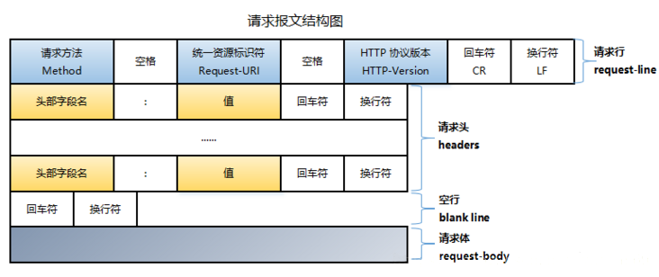
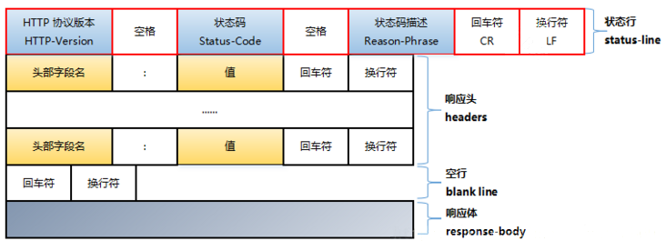
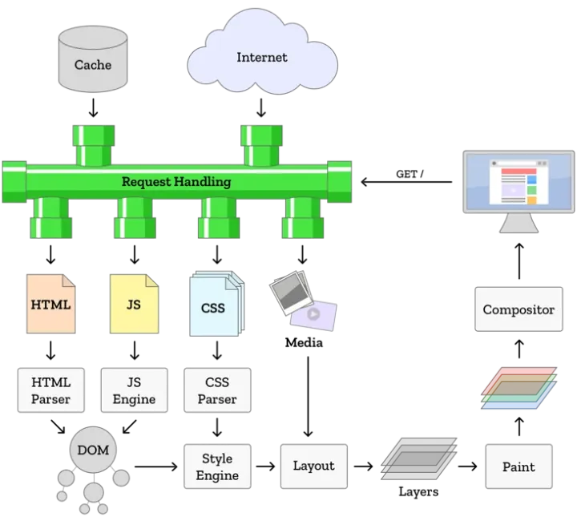
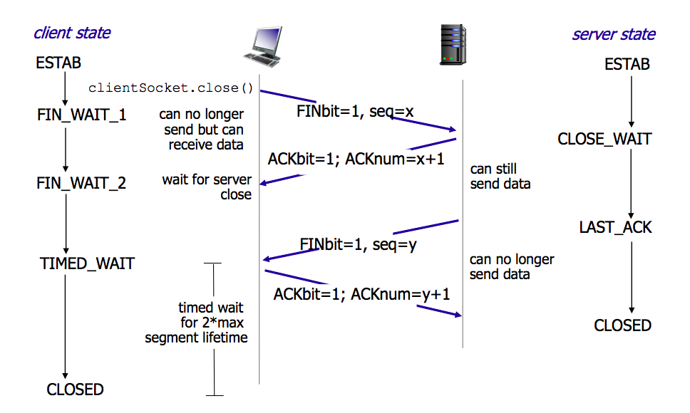
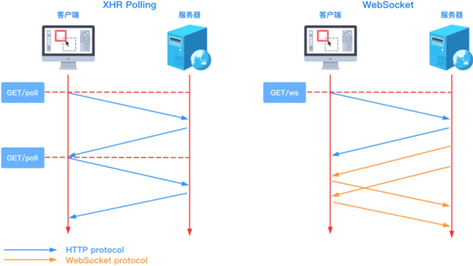
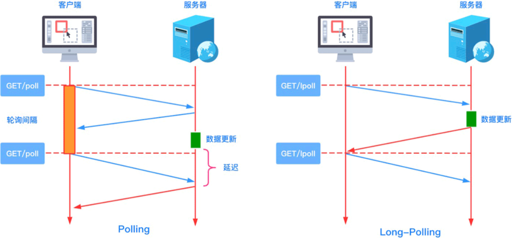

## 输入URL到浏览器呈现

### 1. 输入 URL 按下回车，浏览器检查缓存

#### URL 统一资源定位符

URL 代表着是**统一资源定位符**(Uniform Resource Locator)；URL 无非就是一个给定的独特资源在 Web 上的地址；理论上说，每个有效的 URL 都指向一个唯一的资源；这个资源可以是一个 HTML 页面，一个 CSS 文档，一幅图像，等等；而在实际中，也有一些例外，最常见的情况就是一个 URL 指向了不存在的或是被移动过的资源；由于通过 URL 呈现的资源和 URL 本身由 Web 服务器处理，因此 web 服务器的拥有者需要认真地维护资源以及与它关联的 URL。

```sh
http://www.example.com:80/path/to/myfile.html?key1=value1&key2=value2#SomewhereInTheDocument
```

|                          |      | 描述                                                         |
| ------------------------ | ---- | :----------------------------------------------------------- |
| http://                  | 协议 | 它表明了浏览器必须使用何种协议，它通常都是 HTTP 协议或是 HTTP 协议的安全版，即 HTTPS；<br />Web 需要它们二者之一，但浏览器也知道如何处理其他协议，比如mailto:(打开邮件客户端)或者 ftp:(处理文件传输)。 |
| www.example.com          | 域名 | 它表明正在请求哪个 Web 服务器，或者，可以直接使用IP address，但是因为它不太方便，所以它不经常在网络上使用。 |
| :80                      | 端口 | 它表示用于访问 Web 服务器上的资源的技术“门”，<br />如果 Web 服务器使用 HTTP 协议的标准端口(HTTP 为 80，HTTPS 为 443)来授予其资源的访问权限，则通常会被忽略；否则是强制性的。 |
| /path/to/myfile.html     | 路径 | 是网络服务器上资源的路径；在 Web 的早期阶段，像这样的路径表示 Web 服务器上的物理文件位置；<br />如今，它主要是由没有任何物理现实的 Web 服务器处理的抽象。 |
| ?key1=value1&key2=value2 | 参数 | 是提供给网络服务器的额外参数；这些参数是用 & 符号分隔的键/值对列表；<br />在返回资源之前，Web服务器可以使用这些参数来执行额外的操作；<br />每个Web服务器都有自己关于参数的规则，唯一可靠的方式来知道特定Web服务器是否处理参数是通过询问Web服务器所有者。 |
| #SomewhereInTheDocument  | 锚点 | 是资源本身的另一部分的锚点；锚点表示资源中的一种“书签”，给浏览器显示位于该“加书签”位置的内容的方向；<br />例如，在 HTML 文档上，浏览器将滚动到定义锚点的位置；在视频或音频文档上，浏览器将尝试转到锚代表的时间；<br />值得注意的是，＃后面的部分(也称为片段标识符)**从来没有发送到请求的服务器**。 |

#### HTTP 缓存

HTTP 缓存会存储与请求关联的响应，并将存储的响应复用于后续请求。


#### 强缓存与协商缓存的区别

|          | 获取资源形式 | 状态码              | 是否发送请求                     |
| -------- | ------------ | ------------------- | -------------------------------- |
| 强缓存   | 缓存读取     | 200（from cache）   | 否                               |
| 协商缓存 | 缓存读取     | 304（not modified） | 是，需服务器验证告知缓存是否过期 |

#### 强缓存

根据 http 头中的 `Expires `和 `Cache-Control` 两个字段进行判断来控制缓存是否命中。

如果命中，则直接在内存，状态码 `200（from memory cache）` 或硬盘，状态码 `200（from disk cache）` 中读取缓存数据，无需发送网络请求。

##### Expires（HTTP1.0）

```sh
expires: Thu, 14 Jan 2023 11:11:11 GMT
```

- **工作原理**：当试图再次向服务器请求资源，浏览器就会对比本地时间和 Expires 的时间戳，如果本地时间小于 Expires 设定的过期时间，就直接从缓存中获取这个资源。

- **痛点**：由于 Expires 的时间戳是服务器定义的，而本地时间的取值来自客户端，因此 expires 的工作机制对于客户端时间和服务器时间的一致性要求极高，如果两者的时间存在时差，会带来意料之外的结果。

##### Cache-Control（HTTP1.1）

```sh
Cache-Control: public	# 共享缓存，即由缓存代理服务器提供的缓存，响应可以被多个客户端缓存。
Cache-Control: private	# 私有缓存，响应只能被单个客户端缓存。
Cache-Control: no-store	# 不使用缓存。
Cache-Control: no-cache	# 使用缓存前，无论本地副本是否过期，都需要请求源服务器进行验证（协商缓存）。
Cache-Control: max-age=秒	# 设置缓存存储的最大期限，超过这个期限缓存被认为过期，时间是相对于请求的时间。
Cache-Control: s-maxage=秒	# 同 max-age，仅适用于代理服务器（共享缓存）。

Cache-Control: must-revalidate	# 如果本地副本未过期，则可继续供客户端使用，不需要向源服务器再验证；
# 如果本地副本已过期（比如已经超过max-age），在成功向源服务器验证之前，缓存不能用该资源响应后续请求。

Cache-Control: proxy-revalidate	# 同 must-revalidate，仅适用于共享缓存。

Pragma: no-cache # 用来向后兼容只支持 HTTP/1.0 协议的缓存服务器，与 Cache-Control: no-cache 效果一致。
```

>  [!tip]
>
> 在 HTTP1.1 标准试图将缓存相关配置收敛进 Cache-Control 这样的大背景下，max-age 可以视作是对 Expires 能力的补位/替换。在当下的前端实践里，普遍会倾向于使用 max-age。但如果有对向下兼容有强诉求，那么 Expires 仍然是不可缺少的；当 Cache-Control 与 Expires 同时存在时，以 Cache-Control 为准。

#### 协商缓存

浏览器需要向服务器去询问缓存的相关信息，进而判断是重新发起请求、下载完整的响应，还是从本地获取缓存的资源。

如果服务端提示缓存资源未改动，返回状态码 `304（Not Modified）`，资源会被重定向到浏览器缓存。

##### Last-Modified & If-Modified-Since（HTTP1.0）

Last-Modified 表示资源的最后修改时间，是一个时间戳，如果启用了协商缓存，它会在首次请求时随着 Response Headers 返回。

If-Modified-Since 是一个请求首部字段，并且只能用在 GET 或 HEAD 请求中。客户端再次请求服务器时，请求头会包含这个字段，后面跟着在缓存中获取的资源的最后修改时间。

- **工作原理**：服务端收到请求发现此请求头中有 If-Modified-Since 字段，会与被请求资源的最后修改时间进行对比，如果一致则会返回 304（Not Modified）和响应报文头，浏览器从缓存中获取数据即可。如果被修改了，就返回整个数据 200（OK）。
- **痛点**：
  - 如果资源更新的速度是秒以下单位，那么该缓存是不能被使用的，因为 If-Modified-Since 只能检查到以秒为最小计量单位的时间差。
  - 如果文件是通过服务器动态生成的，那么该方法的更新时间永远是生成的时间，尽管文件可能没有变化，所以起不到缓存的作用。
  - 编辑了文件，但文件的内容没有改变。服务端并不清楚我们是否真正改变了文件，它仍然通过最后编辑时间进行判断。因此这个资源在再次被请求时，会被当做新资源，进而引发一次完整的响应——不该重新请求的时候，也会重新请求。

##### Etag & If-None-Match（HTTP1.1）

Etag 是一个响应首部字段，是根据实体内容生成的一段 hash 字符串，标识资源的状态，由服务端产生。

If-None-Match 是一个条件式的请求首部，如果请求资源时在请求首部加上这个字段，值为之前服务器返回的 Etag，当服务器上任务资源的 Etag 属性值与这个值相符时，服务器会返回不带实体的 304 响应。不相符时返回带有请求资源实体的 200 响应。

> [!tip]
>
> Etag 的生成过程需要服务器额外付出开销，会影响服务端的性能，这是它的弊端。因此启用 Etag 需要审时度势。Etag 并不能替代 Last-Modified，它只能作为 Last-Modified 的补充和强化存在。 Etag 在感知文件变化上比 Last-Modified 更加准确。当 Etag 和 Last-Modified 同时存在时，以 Etag 为准。

### 2. DNS 解析

DNS，Domain Name System/域名系统，一个面向互联网的将域名和 IP 地址相互映射的一个分布式数据库；是一个树状结构的记录、映射域名和 IP 地址的分布式系统；DNS 查询使用 UDP 协议。

通常情况下，主机向本地名称服务器的查询一般都是采用**递归查询**，而本地名称服务器向 DNS(一级、二级、三级...)名称服务器采用**迭代查询**。

#### 递归查询

**触发条件:** 1. 默认触发 ；2. RD 设置为 1 触发。

以**本地名称服务器**为中心，DNS 客户端只是发出原始的域名查询请求报文，然后就一直处于等待状态，直到本地名称服务器发来了最终的查询结果；此时的本地名称服务器就相当于**中介代理**的作用

#### 迭代查询

**触发条件:** 1. 在所配置的本地名称服务器上查询触发（因为本地名称服务器禁止使用递归查询）；2. RD 设置为 0 触发。

以 **DNS 客户端自己**为中心；所有查询工作全部是 DNS 客户端自己进行；**DNS 客户**会按照顺序向本地名称服务器、一级名称服务器、二级名称服务器、权威名称服务器发出查询 DNS 的请求查询报文，这个过程中每一级服务器就会返回一个能解答这个查询的下一个名称服务器列表 A，获取到下个查询列表信息 A 后 DNS 客户会再向返回的列表 A 中发出请求，直到找到最终负责所查域名的名称服务器，从它得到最终结果。

#### 解析流程

浏览器缓存 ==> 本地 hosts 文件 ==> 本地路由缓存 ==> 本地 DNS 服务器 ==> 各级域名服务器 ==> 权威服务器 ==> 缓存结果

### 3. 建立 TCP 连接（三次握手）


### 4. 浏览器发起 HTTP 请求，服务器处理 HTTP 请求



#### 请求方法

```sh
GET：请求一个指定资源的表示形式，使用 GET 的请求应该只被用于获取数据。 // HTTP/1.0
POST：将实体提交到指定的资源，通常导致在服务器上的状态变化或副作用。 // HTTP/1.0
HEAD：请求一个与 GET 请求的响应相同的响应，但没有响应体，只返回报文头。 // HTTP/1.0
PUT：请求有效载荷替换目标资源的所有当前表示，在指明的URL下存储一个文档(取代指定文档)。 // HTTP/1.1
DELETE：删除指定的资源，请求服务器删除指定的页面。 // HTTP/1.1
CONNECT: 方法建立一个到由目标资源标识的服务器的隧道。 // HTTP/1.1
OPTIONS: 用于描述目标资源的通信选项。 // HTTP/1.1
OPETION：请求一些选项的信息(允许客户端查看服务器的性能)。 // HTTP/1.1
TRACE: 沿着到目标资源的路径执行一个消息环回测试，主要用于测试或者诊断。 // HTTP/1.1
```

### 5. 浏览器接收 HTTP 响应



#### 响应状态码

```sh
1XX：信息性状态码(接收请求正在处理)。
2XX：成功状态码(请求正常处理完毕)。
3XX：重定向状态码(需要进行附加操作以完成请求)。
4XX：客户端错误状态码(服务器无法处理请求)。
5XX：服务端错误状态码(服务器处理请求出错)。

100(继续)请求者应当继续提出请求。服务器返回此代码表示已收到请求的第一部分，正在等待其余部分。
101(切换协议)请求者已要求服务器切换协议，服务器已确认并准备切换。

200(成功)服务器已成功处理了请求。通常，这表示服务器提供了请求的网页。
201(已创建)请求成功并且服务器创建了新的资源。
202(已接受)服务器已接受请求，但尚未处理。
203(非授权信息)服务器已成功处理了请求，但返回的信息可能来自另一来源。
204(无内容)服务器成功处理了请求，但没有返回任何内容。
205(重置内容)服务器成功处理了请求，但没有返回任何内容。
206(部分内容)服务器成功处理了部分 GET 请求。

300(多种选择)针对请求，服务器可执行多种操作。服务器可根据请求者(user agent)选择一项操作，或提供操作列表供请求者选择。
301(永久移动)请求的网页已永久移动到新位置。服务器返回此响应(对 GET 或 HEAD 请求的响应)时，会自动将请求者转到新位置。
302(临时移动)服务器目前从不同位置的网页响应请求，但请求者应继续使用原有位置来进行以后的请求。
303(查看其他位置)请求者应当对不同的位置使用单独的 GET 请求来检索响应时，服务器返回此代码。
304(未修改)自从上次请求后，请求的网页未修改过。服务器返回此响应时，不会返回网页内容。
305(使用代理)请求者只能使用代理访问请求的网页。如果服务器返回此响应，还表示请求者应使用代理。
307(临时重定向)服务器目前从不同位置的网页响应请求，但请求者应继续使用原有位置来进行以后的请求。

400(错误请求)表示客户端请求的语法错误，服务器无法理解，例如 url 含有非法字符、json 格式有问题。
401(未授权)请求要求身份验证。对于需要登录的网页，服务器可能返回此响应。
402表示保留，将来使用。
403(禁止)表示服务器理解请求客户端的请求，但是拒绝请求。
404(未找到)服务器无法根据客户端的请求找到资源(网页)。
405(方法禁用)禁用请求中指定的方法。
406(不接受)无法使用请求的内容特性响应请求的网页。
407(需要代理授权)此状态代码与 401(未授权)类似，但指定请求者应当授权使用代理。
408(请求超时)服务器等候请求时发生超时。
409(冲突)服务器在完成请求时发生冲突。服务器必须在响应中包含有关冲突的信息。
410(已删除)如果请求的资源已永久删除，服务器就会返回此响应。
411(需要有效长度)服务器不接受不含有效内容长度标头字段的请求。
412(未满足前提条件)服务器未满足请求者在请求中设置的其中一个前提条件。
413(请求实体过大)表示响应实在太大。服务器拒绝处理当前请求，请求超过服务器所能处理和允许的最大值。
414(请求的 URI 过长)请求的 URI(通常为网址)过长，服务器无法处理。
415(不支持的媒体类型)请求的格式不受请求页面的支持。
416(请求范围不符合要求)如果页面无法提供请求的范围，则服务器会返回此状态代码。
417(未满足期望值)在请求头 Expect 指定的预期内容无法被服务器满足(力不从心)。
418表示我是一个茶壶。超文本咖啡馆控制协议，但是并没有被实际的 HTTP 服务器实现。
420表示方法失效。
422表示不可处理的实体。请求格式正确，但是由于含有语义错误，无法响应。

500(服务器内部错误)服务器遇到了一个未曾预料的状况，导致了它无法完成对请求的处理。
501(尚未实施)服务器不具备完成请求的功能。例如，服务器无法识别请求方法时可能会返回此代码。
502(错误网关)服务器作为网关或代理，从上游服务器收到无效响应。
503(服务不可用)服务器目前无法使用(由于超载或停机维护)。通常，这只是暂时状态。
504(网关超时)服务器作为网关或代理，但是没有及时从上游服务器收到请求。
505(HTTP 版本不受支持)服务器不支持请求中所用的 HTTP 版本。
```

### 6. 渲染页面（关键渲染路径）



### 7. 关闭 TCP 连接（四次挥手）




## 连接与轮询

### 连接

#### HTTP

HTTP 是基于 TCP 的应用层协议，HTTP1.1 默认使用的是 TCP 长连接（在一段时间内保持 TCP 连接），后续 HTTP 请求可以复用此连接进行传输。

#### WebSocket

WebSocket 在单个 TCP 连接上进行全双工通讯的协议。WebSocket 通信协议于 2011 年被 IETF 定为标准 RFC 6455，并由 RFC7936 补充规范。WebSocket API 也被 W3C 定为标准。

WebSocket 使得客户端和服务器之间的数据交换变得更加简单，**允许服务端主动向客户端推送数据**。

在 WebSocket API 中，浏览器和服务器只需要完成一次握手，两者之间就直接可以创建持久性的连接，并进行双向数据传输。



### 轮询

- **短轮询（Polling）**：的实现思路就是浏览器端每隔几秒钟向服务器端发送 HTTP 请求，服务端在收到请求后，不论是否有数据更新，都直接进行响应。

- **长轮询（Long-Polling）**：客户端发送请求后服务器端不会立即返回数据，服务器端会阻塞请求连接不会立即断开，直到服务器端有数据更新或者是连接超时才返回，客户端才再次发出请求新建连接、如此反复从而获取最新数据。



## 优化重绘和重排

理解此概念需要先行了解**关键渲染路径（CRP，Critical Rendering Path）**相关概念。

### 重绘

当一个元素的外观发生改变，但没有改变布局，重新把元素外观绘制出来的过程，叫做重绘。

### 重排

当DOM的变化影响了元素的几何信息（元素的的位置和尺寸大小），浏览器需要重新计算元素的几何属性，将其安放在界面中的正确位置，这个过程叫做重排。

#### 触发时机

- 页面初始渲染，这是开销最大的一次重排。
- 添加/删除可见的DOM元素。
- 改变元素位置。
- 改变元素尺寸，比如边距、填充、边框、宽度和高度等。
- 改变元素内容，比如文字数量，图片大小等。
- 改变元素字体大小。
- 改变浏览器窗口尺寸，比如resize事件发生时。
- 激活CSS伪类（例如：`:hover`）。
- 设置 style 属性的值，因为通过设置style属性改变结点样式的话，每一次设置都会触发一次reflow。
- 查询某些属性或调用某些计算方法：offsetWidth、offsetHeight等，除此之外，当我们调用 `getComputedStyle` 方法，或者IE里的 `currentStyle` 时，也会触发重排，原理是一样的，都为求一个“即时性”和“准确性”。

由于浏览器渲染界面是基于流式布局模型的，所以触发重排时会对周围 DOM 重新排列，影响的范围有两种：

- **全局范围**：从根节点 html 开始对整个渲染树进行重新布局。
- **局部范围**：对渲染树的某部分或某一个渲染对象进行重新布局。

### 优化方案

重排的代价是高昂的，会破坏用户体验，并且让 UI 展示非常迟缓。通过减少重排的负面影响来提高用户体验的最简单方式就是尽可能的减少重排次数，重排范围。

#### 减少重排范围

1. 尽可能将修改应用到具体 DOM 元素上。
2. 不使用 table 布局，很小的一个小改动都会造成整个 table 的重新布局。

#### 减少重排次数

1. 样式集中改变。
2. 分离读写操作（读操作会导致清空渲染队列）。
3. 将 DOM 离线。
   - display: none
   - [`documentFragment`](https://developer.mozilla.org/zh-CN/docs/Web/API/DocumentFragment)
   - 复制节点操作
4. 元素脱离文档流。

