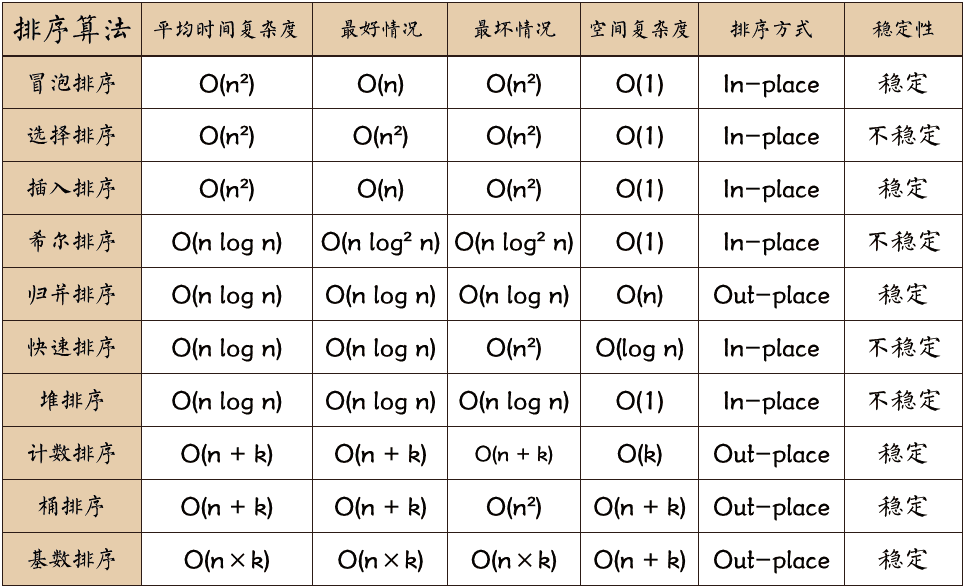
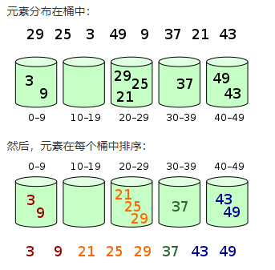

## 算法一览表



- **n**：数据规模。
- **k**："桶"的个数。
- **In-place**：占用常数内存，不占用额外内存。
- **Out-place**：占用额外内存。
- **稳定性**：排序后 2 个相等键值的顺序和排序之前它们的顺序相同。

## 工具函数

```typescript
// ? 交换数组中数据
function _swap(arr: unknown[], oldIndex: number, newIndex: number) {
  let temp = arr[oldIndex]
  arr[oldIndex] = arr[newIndex]
  arr[newIndex] = temp
}

// ? 自定义排序函数
function _sort(arr: unknown[]) { ... }
```

## 冒泡排序

判断当前索引与后一个索引的值，符合要求则进行交换；判断次数需减去当前遍历个数（已排序完成数）；若遍历未交换数据可提前退出（数据已排序）。


```typescript
// ? 冒泡排序
function bubbleSort(arr: number[]) {
  const length = arr.length
  for (let i = 0; i < length - 1; i++) {
    let flag = true
    for (let j = 0; j < length - 1 - i; j++) {
      if (arr[j] > arr[j + 1]) {
        _swap(arr, j, j + 1)
        flag = false
      }
    }
    if (flag) {
      return // 无交换直接退出
    }
  }
}

// ? 双向冒泡排序
function dbBubbleSort(arr: number[]) {
  let leftIndex = 0
  let rightIndex = arr.length - 1
  while (leftIndex < rightIndex) {
    let flag = true
    // 从左至右进行遍历
    for (let i = leftIndex; i < rightIndex; i++) {
      if (arr[i] > arr[i + 1]) {
        _swap(arr, i, i + 1)
        flag = false
      }
    }
    rightIndex--
    // 从右至左进行遍历
    for (let i = rightIndex; i > leftIndex; i--) {
      if (arr[i] < arr[i - 1]) {
        _swap(arr, i, i - 1)
        flag = false
      }
    }
    leftIndex++
    if (flag) {
      return // 无交换直接退出
    }
  }
}
```

## 选择排序

找到当前最小|最大值的索引，交换数据至当前遍历索引。


```typescript
// ? 选择排序
function selectionSort(arr: number[]) {
  const length = arr.length
  for (let i = 0; i < length - 1; i++) {
    let min = i
    for (let j = i; j < length; j++) {
      if (arr[j] < arr[min]) {
        min = j
      }
    }
    // 找到新索引则交换数据至当前遍历索引
    if (min !== i) {
      _swap(arr, i, min)
    }
  }
}
```

## 插入排序

通过构建有序序列，对于未排序数据，在已排序序列中从后向前扫描，找到相应位置并插入。


```typescript
// ? 插入排序
function insertionSort(arr: number[]) {
  const length = arr.length
  for (let i = 1; i < length; i++) {
    let temp = arr[i]
    let j = i
    while (j > 0 && arr[j - 1] > value) {
      arr[j] = arr[j - 1]
      j--
    }
    arr[j] = temp // 插入到最终位置
  }
}
```

## 希尔排序

先将整个待排序的记录序列分割成为若干子序列分别进行直接插入排序，待整个序列中的记录"基本有序"时，再对全体记录进行依次直接插入排序。


```typescript
// ? 希尔排序
function shellSort(arr: number[]) {
  const length = arr.length
  let gap = Math.floor(length / 2) // 获取起始增量
  while (gap >= 1) {
    for (let i = gap; i < length; i++) {
      let temp = arr[i]
      let j = i
      while (j > gap - 1 && arr[j - gap] > temp) {
        arr[j] = arr[j - gap]
        j -= gap
      }
      arr[j] = temp
    }
    gap = Math.floor(gap / 2) // 更新增量
  }
}
```

## 并归排序

分而治之思想，拆分数组为最简，比较符合条件的数据优先填充至返回容器中，依次排序返回直至排序完毕。


```typescript
// ? 并归排序
function mergeSort(arr: number[]) {
  if (arr.length < 2) return arr
  let mid = Math.floor(arr.length / 2)
  let left = arr.slice(0, mid)
  let right = arr.slice(mid)
  return _mergeSort(mergeSort(left), mergeSort(right)) // 递归拆分数组并排序
}
function _mergeSort(left: number[], right: number[]) {
  let result = []
  while (left.length > 0 && right.length > 0) {
    if (left[0] <= right[0]) {
      result.push(left.shift())
    } else {
      result.push(right.shift())
    }
  }
  if (left.length || right.length) {
    return [...result, ...left, ...right]
  }
  return result // 返回数据容器
}
```

## 快速排序

分而治之思想，冒泡排序基础上的递归分治法。


```typescript
// ? 快速排序-简易实现
function quickSimpleSort(arr: number[]) {
  const length = arr.length
  if (length <= 1) {
    return arr
  }
  let pivotIndex = Math.floor(length / 2)
  let pivot = arr.splice(pivotIndex, 1)[0]
  let left = []
  let right = []
  for (let i = 0; i < length; i++) {
    if (arr[i] < pivot) {
      left.push(arr[i])
    } else {
      right.push(arr[i])
    }
  }
  return [...quickSimpleSort(left), pivot, ...quickSimpleSort(right)] // 合并数组递归调用
}

// ? 快速排序
function quickSort(arr: number[], left: number = 0, right: number = arr.length - 1) {
  if (left >= right) {
    return
  }
  let pivotIndex = _findMedianIndex(arr, left, right)
  let pivot = arr[pivotIndex]
  let leftPoint = left
  let rightPoint = right
  while (leftPoint !== rightPoint) {
    while (arr[rightPoint] >= pivot && rightPoint > leftPoint) {
      rightPoint--
    }
    while (arr[leftPoint] <= pivot && leftPoint < rightPoint) {
      leftPoint++
    }
    if (leftPoint < rightPoint) {
      _swap(arr, leftPoint, rightPoint)
    }
  }
  _swap(arr, pivotIndex, leftPoint)
  quickSort(arr, left, leftPoint - 1)
  quickSort(arr, leftPoint + 1, right)
}
// ? 返回左侧（中间值）索引
function _findMedianIndex(arr: number[], left: number, right: number) {
  const medianIndex = Math.floor((left + right) / 2)
  if (arr[left] > arr[medianIndex]) {
    _swap(arr, left, medianIndex)
  }
  if (arr[medianIndex] > arr[right]) {
    _swap(arr, medianIndex, right)
  }
  if (arr[left] < arr[medianIndex]) {
    _swap(arr, left, medianIndex)
  }
  return left
}
```

## 堆排序

堆排序（Heapsort）是指利用堆这种数据结构所设计的一种排序算法。堆积是一个近似完全二叉树的结构，并同时满足堆积的性质：即子结点的键值或索引总是小于（或者大于）它的父节点。堆排序可以说是一种利用堆的概念来排序的选择排序。


```typescript
// ? 堆排序
function heapSort(arr: number[]) {
  const length = arr.length
  for (let i = Math.floor(length / 2) - 1; i >= 0; i--) {
    _adjustHeap(arr, i, length)
  }
  for (let j = length - 1; j > 0; j--) {
    _swap(arr, j, 0)
    _adjustHeap(arr, 0, j)
  }
}

function _adjustHeap(arr: number[], i: number, length: number) {
  const temp = arr[i]
  for (let k = i * 2 + 1; k < length; k = k * 2 + 1) {
    // 判断左节点
    if (k + 1 < length && arr[k] < arr[k + 1]) {
      k++ // 跳转右节点
    }
    // 判断当前节点与父节点
    if (arr[k] > temp) {
      arr[i] = arr[k] // 交换节点值
      i = k
    } else {
      break // 当前未交换，进行下一次构建
    }
    arr[i] = temp // 为当前判断节点赋值
  }
}
```

## 计数排序

计数排序的核心在于将输入的数据值转化为键存储在额外开辟的数组空间中。作为一种线性时间复杂度的排序，计数排序要求输入的数据必须是有确定范围的整数。


```typescript
// ? 计数排序
function countingSort(arr: number[]) {
  let counting = []
  for (const item of arr) {
    if (!counting[item]) {
      counting[item] = 0
    }
    counting[item]++
  }
  const result = []
  const length = counting.length
  for (let i = 0; i < length; i++) {
    const item = counting[i]
    if (item) {
      for (let j = 0; j < item; j++) {
        result.push(i)
      }
    }
  }
  return result
}
```

## 桶排序

桶排序是计数排序的升级版。它利用了函数的映射关系，高效与否的关键就在于这个映射函数的确定。为了使桶排序更加高效，需要做到这两点：

1. 在额外空间充足的情况下，尽量增大桶的数量；
2. 使用的映射函数能够将输入的 N 个数据均匀的分配到 K 个桶中。

同时，对于桶中元素的排序，选择何种比较排序算法对于性能的影响至关重要。



```typescript
// ? 桶排序
function bucketSort(arr: number[], amount: number = 5) {
  let max = arr[0]
  let min = arr[0]
  for (const value of arr) {
    if (value > max) {
      max = value
    } else if (value < min) {
      min = value
    }
  }
  const bucketAmount = Math.floor((max - min) / amount) + 1
  const buckets = Array.from({ length: bucketAmount }, () => [])
  for (const value of arr) {
    buckets[Math.floor((value - min) / amount)].push(value)
  }
  const result = []
  for (const bucket of buckets) {
    _sort(bucket)
    for (const value of bucket) {
      result.push(value)
    }
  }
  return result
}
```

## 基数排序

基数排序是一种非比较型整数排序算法，其原理是将整数按位数切割成不同的数字，然后按每个位数分别比较。由于整数也可以表达字符串（比如名字或日期）和特定格式的浮点数，所以基数排序也不是只能使用于整数。


```typescript
// ? 基数排序
function radixSort(arr: number[], radix: number = 10) {
  let max = arr[0]
  for (const value of arr) {
    if (value > max) {
      max = value
    }
  }
  const buckets = Array.from({ length: radix }, () => [])
  let bit = 1
  // 须为 <=，使 radix 的倍数不会跳出
  while (bit <= max) {
    for (const value of arr) {
      let radixValue = Math.floor((value % (bit * radix)) / bit)
      buckets[radixValue].push(value)
    }
    let index = 0
    for (const bucket of buckets) {
      while (bucket.length > 0) {
        arr[index++] = bucket.shift()
      }
    }
    bit *= radix // 更新位数
  }
}
```

