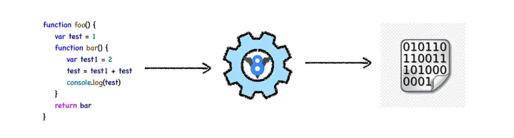
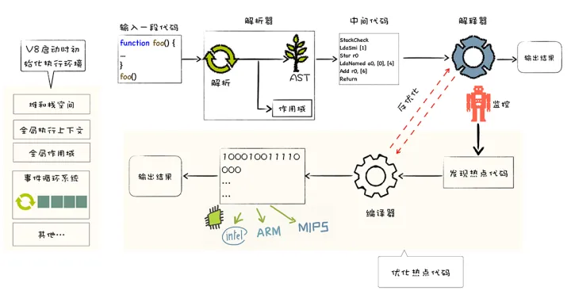
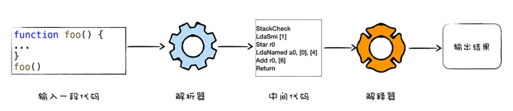
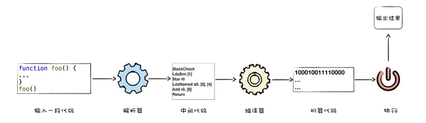
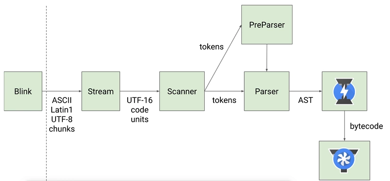
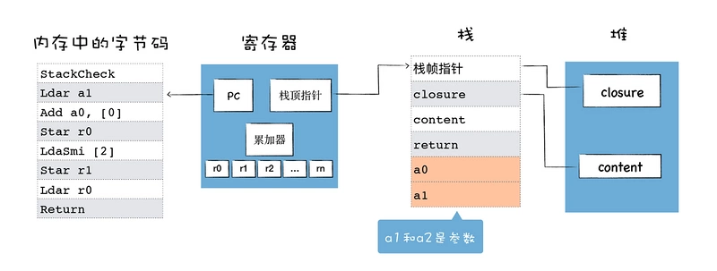
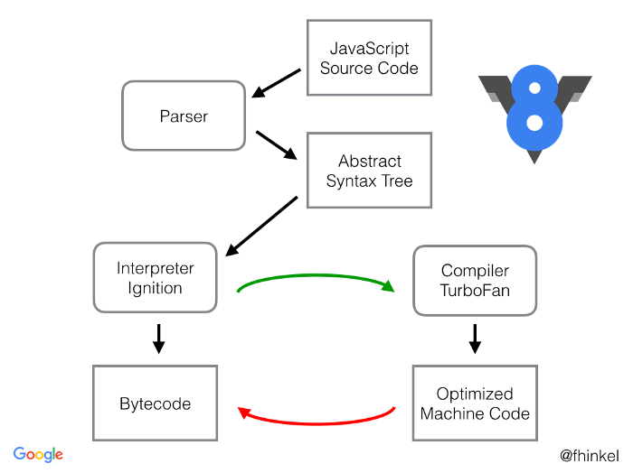

[V8](https://v8.dev/) 是 Google 的开源高性能 JavaScript 和 WebAssembly 引擎，用 C++编写。它用于 Chrome 和 Node.js 等。它实现 ECMAScript 和 WebAssembly，并在 Windows 7 或更高版本、macOS 10.12+以及使用 x64、IA-32、ARM 或 MIPS 处理器的 Linux 系统上运行。V8 可以独立运行，也可以嵌入到任何 C++应用程序中。

## 执行流程

## 概念

### 解释执行

解释（Interpret）的过程是把源程序代码一行一行的读懂，然后一行一行的执行，发生在运行时，产物是**运行结果**。

解释器（interpreter），是一种计算机程序，能够把解释型语言解释执行。其实就是执行解释的过程。

### 编译执行

编译（Compile）的过程是把整个源程序代码翻译成另外一种代码，翻译后的代码等待被执行或者被优化等等，发生在运行之前，产物是**另一份代码**。

编译器（Compiler）是一种计算机程序，它会将某种编程语言编写的源代码（原始语言）转换成另一种编程语言（目标语言），其实就是完成上文中所说的编译的过程。主要目的是将便于人编写、阅读维护的高级计算机语言所编写的源代码程序，翻译为计算机能运行的机器语言程序。

### 字节码

**早期的 V8** 为了提升代码的**执行速度**，直接将 JavaScript 源代码编译成了**没有优化的二进制机器代码**，如果某一段二进制代码执行频率过高，那么 V8 会将其标记为**热点代码**，热点代码会被优化编译器优化，优化后的机器代码执行效率更高。

随着移动设备的普及，V8 团队逐渐发现将 JavaScript 源码直接编译成二进制代码存在两个致命的问题：

1. **时间问题**：编译时间过久，影响代码启动速度；
2. **空间问题**：缓存编译后的二进制代码占用更多的内存。

这两个问题无疑会阻碍 V8 在移动设备上的普及，于是 V8 团队大规模重构代码，引入了中间的字节码。字节码的优势有如下三点：

- **解决启动问题**：生成字节码的时间很短；
- **解决空间问题**：字节码虽然占用的空间比原始的 JavaScript 多，但是相较于机器代码，字节码还是小了太多，缓存字节码会大大降低内存的使用。
- **代码架构清晰**：采用字节码，可以简化程序的复杂度，使得 V8 移植到不同的 CPU 架构平台更加容易。

### 机器码（Bytecode）

**某种程度上就是汇编语言，只是它没有对应特定的 CPU，或者说它对应的是虚拟的 CPU**。这样的话，生成 Bytecode 时简单很多，无需为不同的 CPU 生产不同的代码。要知道，V8 支持 9 种不同的 CPU，引入一个中间层 Bytecode，可以简化 V8 的编译流程，提高可扩展性。

如果我们在不同硬件上去生成 Bytecode，会发现生成代码的指令是一样的。

## 引擎结构

### Parse

将 JavaScript 源码转换为 Abstract Syntax Tree (AST)

确切的说，在“Parser”将 JavaScript 源码转换为 AST 前，还有一个叫”Scanner“的过程，具体流程如下：

### Ignition

解释器，负责将 AST 转换为 Bytecode，解释执行 Bytecode；同时收集 TurboFan 优化编译所需的信息，比如函数参数的类型。

**通常有两种类型的解释器，基于栈 (Stack-based)和基于寄存器 (Register-based)**，

基于栈的解释器使用栈来保存函数参数、中间运算结果、变量等；

基于寄存器的虚拟机则支持寄存器的指令操作，使用寄存器来保存参数、中间计算结果。

通常，基于栈的虚拟机也定义了少量的寄存器，基于寄存器的虚拟机也有堆栈，其**区别体现在它们提供的指令集体系**。**大多数解释器都是基于栈的**，比如 Java 虚拟机，.Net 虚拟机，还有早期的 V8 虚拟机。基于堆栈的虚拟机在处理函数调用、解决递归问题和切换上下文时简单明快。而**现在的 V8 虚拟机则采用了基于寄存器的设计**，它将一些中间数据保存到寄存器中。

### TurboFan

编译器，利用 Ignitio 所收集的类型信息，将 Bytecode 转换为优化的汇编代码。

### Orinoco

垃圾回收模块，负责将程序不再需要的内存空间回收。

简单地说，**Parser 将 JS 源码转换为 AST，然后 Ignition 将 AST 转换为 Bytecode，最后 TurboFan 将 Bytecode 转换为经过优化的 Machine Code(实际上是汇编代码)**。

- 如果函数没有被调用，则 V8 不会去编译它。
- 如果函数只被调用 1 次，则 Ignition 将其编译 Bytecode 就直接解释执行了。TurboFan 不会进行优化编译，因为它需要 Ignition 收集函数执行时的类型信息。这就要求函数至少需要执行 1 次，TurboFan 才有可能进行优化编译。
- 如果函数被调用多次，则它有可能会被识别为**热点函数**，且 Ignition 收集的类型信息证明可以进行优化编译的话，这时 TurboFan 则会将 Bytecode 编译为 Optimized Machine Code（已优化的机器码），以提高代码的执行性能。

图片中的红色虚线是逆向的，也就是说 Optimized Machine Code 会被还原为 Bytecode，这个过程叫做 **Deoptimization**。这是因为 Ignition 收集的信息可能是错误的，比如 add 函数的参数之前是整数，后来又变成了字符串。生成的 Optimized Machine Code 已经假定 add 函数的参数是整数，那当然是错误的，于是需要进行 Deoptimization。

在运行 C、C++以及 Java 等程序之前，需要进行编译，不能直接执行源码；但对于 JavaScript 来说，我们可以直接执行源码(比如：node test.js)，它是在运行的时候先编译再执行，这种方式被称为**即时编译(Just-in-time compilation)**，**简称为 JIT**。因此，V8 也属于 **JIT 编译器**。
