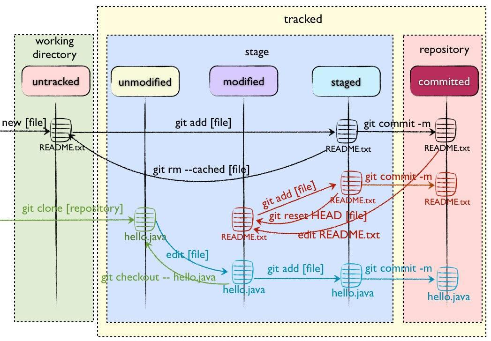

[**Git**](https://zh.wikipedia.org/wiki/Git) 是一个免费开源的分布式版本控制系统，旨在快速高效地处理从小型到大型项目的所有内容。其易于学习，占用空间小，性能快如闪电。超越了 Subversion、CVS、Perforce 和 ClearCase 等 SCM 工具，具有廉价的本地分支、方便的暂存区和多个工作流等功能。

- 下载：https://git-scm.com/downloads

**技术文档**：

- Git 操作手册：https://git-scm.com/book/zh/v2
- Git 命令一览：https://git-scm.com/docs/git
- Git 速查手册（第三版）：https://www.answerywj.com/2020/09/29/git-help-v3/

## 概念

### 工作区域

- **Workspace 工作区**：存放项目代码的目录。

- **Index/Stage 暂存区**：保存下次提交的文件列表信息，本质上是一个叫 index 的文件，一般在 Git 仓库目录中，通常多数说法还是叫暂存区域。

- **Repository 仓库区（或版本库）**：存放数据的位置，存放所有提交到仓库区的版本数据。其中 HEAD 指向最新放入仓库的版本。

- Remote 远程仓库：托管代码的服务器。

### 文件状态

- **Untracked 未跟踪**：文件不参与版本控制。
- **Unmodify  未修改**：文件为最新状态。
  
- **Modified 已修改**：文件已修改。
  
- **Staged 暂存状态**：文件修改已暂时记录。

### 版本控制系统（Version Control System，VCS）

帮助软件团队的开发人员协同工作，并存档他们工作的完整历史记录。

|                              |  网络  |    操作    |    并发性    |
| :--------------------------: | :----: | :--------: | :----------: |
|  第一代（本地版本控制系统）  |   无   | 仅一个文件 |    锁定的    |
| 第二代（集中化版本控制系统） | 集中式 |   多文件   | 提交之前合并 |
| 第三代（分布式版本控制系统） | 分布式 | 变更的集合 | 合并之前提交 |

#### 本地版本控制系统（Local Version Control System，LVCS）

通过加锁将并发执行转换成顺序执行。一次只能有一个人处理文件。

**悲观锁**

- 每次获取数据的时候，都会担心数据被修改，所以每次获取数据的时候都会进行加锁，确保在自己使用的过程中数据不会被别人修改，使用完成后进行数据解锁。

- 由于数据进行加锁，期间对该数据进行读写的其他线程都会进行等待。

#### 集中化版本控制系统（Centralized Version Control Systems，CVCS）

对同步修改更加宽容，但有一个明显的限制，用户必须在允许提交之前将当前修订合并到他们的工作中。

**乐观锁**

- 每次获取数据的时候，都不会担心数据被修改，所以每次获取数据的时候都不会进行加锁，但是在更新数据的时候需要判断该数据是否被别人修改过。

- 如果数据被其他线程修改，则不进行数据更新，如果数据没有被其他线程修改，则进行数据更新。由于数据没有进行加锁，期间该数据可以被其他线程进行读写操作。

#### 分布式版本控制系统（Distributed Version Control Systems，DVCS）

允许合并和提交分开。在每个使用者电脑上就有一个完整的数据仓库，没有网络依然可以使用。

## 特点

### 直接记录快照，而非差异比较

Git 和其他版本控制系统的主要差别在于，Git 只关心文件数据的整体是否发生变化，而大多数其他系统则只关心文件内容的具体差异。这类系统（CVS，Subversion，Perforce，Bazaar 等等）每次记录有哪些文件作了更新，以及都更新了哪些行的什么内容。如图所示：

Git 并不保存这些前后变化的差异数据。实际上，Git 更像是把变化的文件作快照后，记录在一个微型的文件系统中。每次提交更新时，它会纵览一遍所有文件的指纹信息并对文件作一快照，然后保存一个指向这次快照的索引。为提高性能，若文件没有变化，Git 不会再次保存，而只对上次保存的快照作一链接。如图所示：

### 近乎所有操作都是本地执行

在 Git 中的绝大多数操作都只需要访问本地文件和资源，不用连网。但如果用 CVCS 的话，差不多所有操作都需要连接网络。因为 Git 在本地磁盘上就保存着所有当前项目的历史更新，所以处理起来速度飞快。

### 时刻保持数据完整性

在保存到 Git 之前，所有数据都要进行内容的校验和（checksum）计算，并将此结果作为数据的唯一标识和索引。换句话说，不可能在你修改了文件或目录之后，Git 一无所知。这项特性作为 Git 的设计哲学，建在整体架构的最底层。所以如果文件在传输时变得不完整，或者磁盘损坏导致文件数据缺失，Git 都能立即察觉。

### 多数操作仅添加数据

常用的 Git 操作大多仅仅是把数据添加到数据库。因为任何一种不可逆的操作，比如删除数据，都会使回退或重现历史版本变得困难重重。在别的 VCS 中，若还未提交更新，就有可能丢失或者混淆一些修改的内容，但在 Git 里，一旦提交快照之后就完全不用担心丢失数据，特别是养成定期推送到其他仓库的习惯的话。

## 工具

### TortoiseGit

[**TortoiseGit**](https://tortoisegit.org/) 在 Windows 外壳程序中，TortoiseGit 提供了显示文件状态的覆盖图标，一个强大的 Git 上下文菜单等等！

- 下载：https://tortoisegit.org/download/
